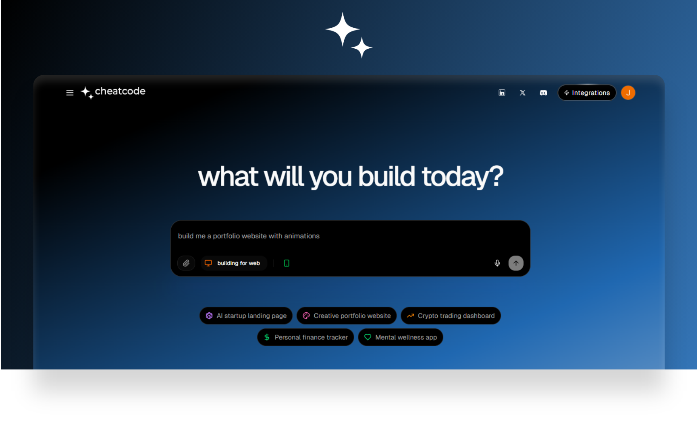
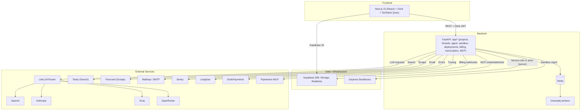

<div align="center">

# Cheatcode - Open Source AI Coding Agent

An open-source, production-ready AI coding agent for apps and websites.

Build, run, and ship full-stack applications with an agent that codes, executes, deploys, and integrates with your stack.

[](./LICENSE-Apache-2.0)
[](#backend)
[](#frontend)
[](#database)



</div>

## Table of Contents

- [Overview](#overview)
- [Architecture](#architecture)
- [Prerequisites](#prerequisites)
- [Quick Start](#quick-start)
- [Local Development](#local-development)
- [Environment Variables](#environment-variables)
- [Repository Structure](#repository-structure)
- [API Documentation](#api-documentation)
- [Self-Hosting](#self-hosting)
- [Technology Stack](#technology-stack)
- [Troubleshooting](#troubleshooting)
- [Contributing](#contributing)
- [License](#license)

## Overview

Cheatcode is a full-stack application that pairs a Next.js dashboard with a FastAPI backend to provide an AI agent capable of:

- Creating and modifying projects and threads with a collaborative chat interface
- Executing actions inside isolated sandboxes using Daytona for code execution and app previews
- Integrating with multiple LLM providers including OpenAI, Anthropic, OpenRouter, and Groq via LiteLLM
- Managing authentication and data through Supabase with Redis for queues and caching
- Supporting web browsing and crawling via external APIs with optional billing and usage tracking

The platform is designed to run locally via Docker Compose or be self-hosted on your own infrastructure.

## Architecture



### Core Components

- **Backend API (FastAPI, Python 3.11)**: REST endpoints, thread/project/message management, LLM orchestration with async background jobs
- **Worker (Dramatiq)**: Processes background jobs including agent runs and long tasks
- **Frontend (Next.js 15 + React 18)**: Authentication via Clerk, data via Supabase and backend REST, UI with Tailwind CSS v4
- **Redis**: Caching, queues, and rate-limiting
- **Supabase**: Database, authentication, storage, and Row Level Security (RLS)

## Prerequisites

### System Requirements

- **Memory**: 4GB RAM minimum, 8GB recommended
- **Storage**: 2GB free space for Docker images
- **OS**: Linux, macOS, or Windows with WSL2

### Required Software

- **Docker 24.0+** and **Docker Compose 2.0+**
- **Node.js 20+** (for local development without Docker)
- **Python 3.11+** (for local development without Docker)
- **Git 2.30+**

### Required Accounts

- **Supabase project** with URL, anon key, and service role key
- **Clerk application** with publishable key and secret key
- **At least one LLM provider**: OpenAI, Anthropic, OpenRouter, or Groq API key

### Optional Integrations

- **Daytona account** for sandbox code execution and app previews
- **Sentry** for error monitoring
- **Langfuse** for LLM observability

## Quick Start

### 1. Clone the Repository

```bash
git clone https://github.com/your-username/deployment-cheatcode.git
cd deployment-cheatcode
```

### 2. Backend Configuration

Create `backend/.env`:

```env
# Core Configuration
ENV_MODE=local
SUPABASE_URL=YOUR_SUPABASE_URL
SUPABASE_ANON_KEY=YOUR_SUPABASE_ANON_KEY
SUPABASE_SERVICE_ROLE_KEY=YOUR_SUPABASE_SERVICE_ROLE_KEY

# Authentication
CLERK_SECRET_KEY=YOUR_CLERK_SECRET_KEY

# Redis (Docker Compose uses service name 'redis')
REDIS_URL=redis://redis:6379

# LLM Providers (choose at least one)
OPENAI_API_KEY=YOUR_OPENAI_API_KEY
ANTHROPIC_API_KEY=YOUR_ANTHROPIC_API_KEY
OPENROUTER_API_KEY=YOUR_OPENROUTER_API_KEY

# Optional: Sandbox Integration
DAYTONA_API_KEY=YOUR_DAYTONA_API_KEY
DAYTONA_SERVER_URL=YOUR_DAYTONA_SERVER_URL
DAYTONA_TARGET=YOUR_DAYTONA_TARGET

# Optional: External Services
TAVILY_API_KEY=YOUR_TAVILY_API_KEY
FIRECRAWL_API_KEY=YOUR_FIRECRAWL_API_KEY
LANGFUSE_PUBLIC_KEY=YOUR_LANGFUSE_PUBLIC_KEY
LANGFUSE_SECRET_KEY=YOUR_LANGFUSE_SECRET_KEY
```

### 3. Frontend Configuration

Create `frontend/.env.local`:

```env
# Backend URL
NEXT_PUBLIC_BACKEND_URL=http://localhost:8000

# Supabase Configuration
NEXT_PUBLIC_SUPABASE_URL=YOUR_SUPABASE_URL
NEXT_PUBLIC_SUPABASE_ANON_KEY=YOUR_SUPABASE_ANON_KEY

# Application URLs
NEXT_PUBLIC_APP_URL=http://localhost:3000
NEXT_PUBLIC_URL=http://localhost:3000

# Authentication
NEXT_PUBLIC_CLERK_PUBLISHABLE_KEY=YOUR_CLERK_PUBLISHABLE_KEY

# Optional: Feature Flags
NEXT_PUBLIC_FEATURE_FLAGS_ENABLED=false
```

### 4. Start the Application

```bash
docker compose up --build
```

### 5. Access the Application

- **Frontend**: http://localhost:3000
- **Backend API**: http://localhost:8000
- **API Health Check**: http://localhost:8000/api/health
- **Redis**: localhost:6379

### 6. First-Run Verification

1. **API Health**: Visit http://localhost:8000/api/health (expect `{ "status": "ok" }`)
2. **Frontend Access**: Visit http://localhost:3000 and sign in with Clerk
3. **Create Project**: Create a new project and thread
4. **Test Agent**: Send a message and start the agent

## Local Development

For development without Docker:

### Backend Development

```bash
cd backend

# Install dependencies (requires uv: https://github.com/astral-sh/uv)
uv sync

# Start the API server
uv run uvicorn main:app --reload --host 0.0.0.0 --port 8000

# In a separate terminal, start the worker
uv run dramatiq --skip-logging --processes 1 --threads 2 run_agent_background
```

### Frontend Development

```bash
cd frontend

# Install dependencies
npm install

# Start development server
npm run dev
```

### Development Workflow

1. Fork the repository
2. Create a feature branch (`git checkout -b feature/amazing-feature`)
3. Make your changes
4. Test locally using the development setup above
5. Commit your changes (`git commit -m 'Add amazing feature'`)
6. Push to your branch (`git push origin feature/amazing-feature`)
7. Open a Pull Request

## Environment Variables

### Backend Variables (`backend/.env`)

| Variable | Required | Description |
|----------|----------|-------------|
| `ENV_MODE` | Yes | Set to `local` for development, `production` for production |
| `SUPABASE_URL` | Yes | Your Supabase project URL |
| `SUPABASE_ANON_KEY` | Yes | Supabase anonymous key |
| `SUPABASE_SERVICE_ROLE_KEY` | Yes | Supabase service role key |
| `CLERK_SECRET_KEY` | Yes | Clerk secret key for authentication |
| `REDIS_URL` | Yes | Redis connection URL (`redis://redis:6379` for Docker Compose) |
| `OPENAI_API_KEY` | * | OpenAI API key |
| `ANTHROPIC_API_KEY` | * | Anthropic API key |
| `OPENROUTER_API_KEY` | * | OpenRouter API key |
| `GROQ_API_KEY` | * | Groq API key |
| `DAYTONA_API_KEY` | No | Daytona API key for sandboxes |
| `DAYTONA_SERVER_URL` | No | Daytona server URL |
| `DAYTONA_TARGET` | No | Daytona target environment |
| `TAVILY_API_KEY` | No | Tavily API key for web search |
| `FIRECRAWL_API_KEY` | No | Firecrawl API key for web scraping |
| `LANGFUSE_PUBLIC_KEY` | No | Langfuse public key for LLM observability |
| `LANGFUSE_SECRET_KEY` | No | Langfuse secret key |
| `SENTRY_DSN` | No | Sentry DSN for error monitoring |

*At least one LLM provider key is required.

### Frontend Variables (`frontend/.env.local`)

| Variable | Required | Description |
|----------|----------|-------------|
| `NEXT_PUBLIC_BACKEND_URL` | Yes | Backend API URL |
| `NEXT_PUBLIC_SUPABASE_URL` | Yes | Supabase project URL |
| `NEXT_PUBLIC_SUPABASE_ANON_KEY` | Yes | Supabase anonymous key |
| `NEXT_PUBLIC_APP_URL` | Yes | Frontend application URL |
| `NEXT_PUBLIC_URL` | Yes | Frontend application URL (duplicate) |
| `NEXT_PUBLIC_CLERK_PUBLISHABLE_KEY` | Yes | Clerk publishable key |
| `NEXT_PUBLIC_FEATURE_FLAGS_ENABLED` | No | Enable feature flags (default: false) |
| `EDGE_CONFIG` | No | Vercel Edge Config (if using Vercel) |

## Repository Structure

```
deployment-cheatcode/
├── backend/                     # FastAPI service, workers, agents, services
│   ├── agent/                   # Agent runtime, tools and prompts
│   ├── services/                # Integrations (billing, email, llm, redis, etc.)
│   ├── mcp_service/             # Secure MCP endpoints
│   ├── sandbox/                 # Sandbox APIs and Docker contexts
│   ├── deployments/             # Deployment APIs
│   ├── utils/                   # Configuration, logging, auth utilities
│   ├── main.py                  # FastAPI application entry point
│   └── pyproject.toml           # Python dependencies managed by uv
├── frontend/                    # Next.js 15 application
│   ├── src/app/                 # App Router pages (home, projects, settings, API routes)
│   ├── src/components/          # Reusable UI components
│   ├── src/contexts/            # React contexts for state management
│   ├── src/hooks/               # React Query and custom hooks
│   ├── src/lib/                 # API clients, configuration, Supabase helpers
│   ├── src/middleware.ts        # Clerk authentication middleware
│   ├── src/providers/           # Application-wide providers
│   ├── src/types/               # Shared TypeScript types
│   └── package.json             # Node.js dependencies
├── docker-compose.yaml          # Multi-service Docker orchestration
├── README.md                    # This file
├── LICENSE-Apache-2.0           # Apache 2.0 license
└── NOTICE                       # Attribution notices for third-party components
```

## API Documentation

### Core Endpoints

All backend endpoints are prefixed with `/api`.

#### Health & Status
- `GET /health` - API health check

#### Projects & Threads
- `GET /projects` - List user projects
- `POST /projects` - Create new project
- `GET /projects/{project_id}` - Get project details
- `GET /threads` - List user threads
- `POST /threads` - Create new thread

#### Agent Management
- `POST /thread/{thread_id}/agent/start` - Start agent run
- `GET /agent-run/{agent_run_id}/status` - Get agent run status
- `POST /agent-run/{agent_run_id}/stop` - Stop agent run
- `GET /thread/{thread_id}/agent-runs` - List thread agent runs

#### Sandbox Operations
- `POST /project/{project_id}/sandbox/ensure-active` - Ensure sandbox is running
- `POST /sandboxes/{sandbox_id}/files` - Upload files to sandbox
- `GET /sandboxes/{sandbox_id}/files` - List sandbox files
- `GET /sandboxes/{sandbox_id}/files/content` - Get file content
- `POST /sandboxes/{sandbox_id}/execute` - Execute command in sandbox
- `GET /sandboxes/{sandbox_id}/preview-url` - Get preview URL

#### Deployment
- `POST /project/{project_id}/deploy/git` - Deploy project to Git
- `POST /project/{project_id}/deploy/git/update` - Update Git deployment
- `GET /project/{project_id}/deployment/status` - Get deployment status
- `GET /project/{project_id}/git/files` - List Git repository files
- `GET /project/{project_id}/git/file-content` - Get Git file content

#### Billing & Usage
- `GET /billing/status` - Get billing status
- `GET /billing/subscription` - Get subscription details
- `GET /billing/usage-history` - Get usage history
- `GET /billing/plans` - List available plans
- `POST /billing/create-checkout-session` - Create checkout session
- `POST /billing/upgrade-plan` - Upgrade subscription plan

#### MCP & Integrations
- `/pipedream/*` - Pipedream integration endpoints
- `/secure-mcp/*` - Secure MCP endpoints

## Self-Hosting

### Production Deployment

1. **Provision Infrastructure**
   - Deploy on any Docker-compatible host (VPS, cloud instance, etc.)
   - Ensure adequate resources (4GB+ RAM recommended)

2. **Configuration**
   - Set `ENV_MODE=production` in `backend/.env`
   - Configure proper domain names and TLS certificates
   - Update CORS settings in `backend/main.py` to include your domain

3. **DNS & TLS**
   - Point your domain to your server
   - Configure reverse proxy (Nginx, Traefik, or Caddy) for HTTPS
   - Expose ports 80/443 instead of 3000/8000

4. **Start Services**
   ```bash
   docker compose up -d --build
   ```

5. **Security Considerations**
   - Use strong passwords and API keys
   - Configure firewall rules
   - Enable HTTPS/TLS encryption
   - Regular security updates for dependencies

### Docker Compose Services

The application consists of four main services:

- **api**: FastAPI backend server
- **worker**: Dramatiq background worker
- **frontend**: Next.js frontend application
- **redis**: Redis cache and message broker

## Technology Stack

### Frontend Technologies
- **Framework**: Next.js 15.3.1 with App Router
- **UI Library**: React 18 with TypeScript 5
- **Styling**: Tailwind CSS 4, Radix UI, shadcn/ui components
- **State Management**: TanStack Query 5, Zustand 5, SWR 2.2.5
- **Code Editor**: CodeMirror 6 with syntax highlighting
- **Authentication**: Clerk
- **Icons**: Lucide React
- **Animations**: Framer Motion

### Backend Technologies
- **Framework**: FastAPI 0.115.12 with Python 3.11
- **Server**: uvicorn 0.27.1 (development), Gunicorn 23 (production)
- **Task Queue**: Dramatiq 1.18.0 with Redis
- **AI/LLM**: LiteLLM 1.72.2, OpenAI 1.90.0, Anthropic, OpenRouter
- **Database**: Supabase (PostgreSQL) with Basejump extensions
- **Sandboxing**: Daytona SDK for cloud development environments
- **Observability**: Sentry, Langfuse 2.60.5, Structlog 25.4.0
- **Payments**: DodoPayments 1.44.0
- **External APIs**: Tavily (search), Firecrawl (web scraping)

### Infrastructure & DevOps
- **Containerization**: Docker and Docker Compose
- **Package Management**: uv 0.6.5 (Python), pnpm/npm (Node.js)
- **Version Control**: Git
- **Development**: mise environment manager

## Troubleshooting

### Common Issues

#### Permission Denied Errors with Docker

```bash
# Fix file permissions
sudo chmod +x docker-compose.yaml
sudo chown -R $USER:$USER .

# Add user to docker group (requires logout/login)
sudo usermod -aG docker $USER
```

#### Backend Not Starting

1. **Check Environment Variables**
   ```bash
   # Verify .env file exists and contains required variables
   cat backend/.env
   ```

2. **Test Supabase Connection**
   ```bash
   curl "YOUR_SUPABASE_URL/rest/v1/" -H "apikey: YOUR_SUPABASE_ANON_KEY"
   ```

3. **Check Redis Connectivity**
   ```bash
   # Check Redis container logs
   docker logs deployment-cheatcode-redis-1
   
   # Test Redis connection
   docker exec -it deployment-cheatcode-redis-1 redis-cli ping
   ```

4. **Verify LLM Provider Keys**
   ```bash
   # Test OpenAI key (replace with your key)
   curl -H "Authorization: Bearer YOUR_OPENAI_KEY" https://api.openai.com/v1/models
   ```

#### Frontend 401 Errors

1. **Verify Clerk Configuration**
   - Check `NEXT_PUBLIC_CLERK_PUBLISHABLE_KEY` in `frontend/.env.local`
   - Ensure `CLERK_SECRET_KEY` is set in `backend/.env`
   - Verify Clerk domain settings match your application URL

2. **Check CORS Settings**
   - Ensure your frontend URL is in `allowed_origins` in `backend/main.py`
   - For custom domains, add them to the CORS configuration

3. **Middleware Issues**
   ```bash
   # Check middleware logs
   docker logs deployment-cheatcode-frontend-1
   ```

#### Database Issues

1. **Missing Tables**
   - Ensure all required Supabase tables exist
   - Check RLS (Row Level Security) policies
   - Verify service role key has proper permissions

2. **Migration Issues**
   ```bash
   # Check backend logs for database errors
   docker logs deployment-cheatcode-api-1
   ```

#### Agent Not Responding

1. **Check Worker Status**
   ```bash
   # Verify worker is running
   docker logs deployment-cheatcode-worker-1
   ```

2. **LLM Provider Issues**
   - Verify API keys are correct and active
   - Check rate limits and usage quotas
   - Review backend logs for LLM errors

3. **Sandbox Issues**
   - Ensure Daytona credentials are configured
   - Check Daytona service status
   - Verify network connectivity to Daytona servers

### Getting Help

1. **Check Logs**
   ```bash
   # View all service logs
   docker compose logs
   
   # View specific service logs
   docker compose logs api
   docker compose logs frontend
   docker compose logs worker
   docker compose logs redis
   ```

2. **Health Checks**
   - API: http://localhost:8000/api/health
   - Frontend: http://localhost:3000
   - Redis: `docker exec -it deployment-cheatcode-redis-1 redis-cli ping`

3. **Common Solutions**
   - Restart services: `docker compose restart`
   - Rebuild containers: `docker compose up --build`
   - Clear Redis cache: `docker exec -it deployment-cheatcode-redis-1 redis-cli flushall`
   - Reset Docker: `docker compose down && docker compose up --build`

## Contributing

We welcome contributions from the community! Please follow these guidelines:

### How to Contribute

1. **Fork the Repository**
   - Click the "Fork" button on the GitHub repository page
   - Clone your fork locally: `git clone https://github.com/YOUR_USERNAME/deployment-cheatcode.git`

2. **Set Up Development Environment**
   - Follow the [Local Development](#local-development) instructions
   - Ensure all tests pass before making changes

3. **Make Your Changes**
   - Create a feature branch: `git checkout -b feature/your-feature-name`
   - Make your changes with clear, descriptive commits
   - Follow existing code style and conventions
   - Add tests for new functionality

4. **Submit Your Contribution**
   - Push your branch: `git push origin feature/your-feature-name`
   - Open a Pull Request with a clear title and description
   - Link any related issues in the PR description

### Development Guidelines

- **Code Style**: Follow existing patterns in the codebase
- **Testing**: Add tests for new features and ensure existing tests pass
- **Documentation**: Update relevant documentation for any changes
- **Commit Messages**: Use clear, descriptive commit messages
- **Pull Requests**: Keep PRs focused and reasonably sized

### Areas for Contribution

- **Bug Fixes**: Help resolve issues in the GitHub issue tracker
- **Features**: Implement new functionality or improve existing features
- **Documentation**: Improve or expand documentation
- **Testing**: Add test coverage or improve existing tests
- **Performance**: Optimize performance bottlenecks
- **Integration**: Add support for new LLM providers or external services

### Code of Conduct

This project follows a code of conduct to ensure a welcoming environment for all contributors. Please be respectful and professional in all interactions.

### Security

If you discover a security vulnerability, please report it responsibly by emailing founders@trycheatcode.com instead of creating a public issue.

## License

Copyright 2025 Cheatcode AI

Portions of this software are derived from [Suna by Kortix AI](https://github.com/kortix-ai/suna), 
which is licensed under the Apache License 2.0. See `NOTICE` file for details.

Licensed under the Apache License, Version 2.0 (the "License"); you may not use this file except in compliance with the License. You may obtain a copy of the License at:

http://www.apache.org/licenses/LICENSE-2.0

Unless required by applicable law or agreed to in writing, software distributed under the License is distributed on an "AS IS" BASIS, WITHOUT WARRANTIES OR CONDITIONS OF ANY KIND, either express or implied. See the License for the specific language governing permissions and limitations under the License.

---

Built by [Jigyansu Rout](https://jigyansurout.com/)
